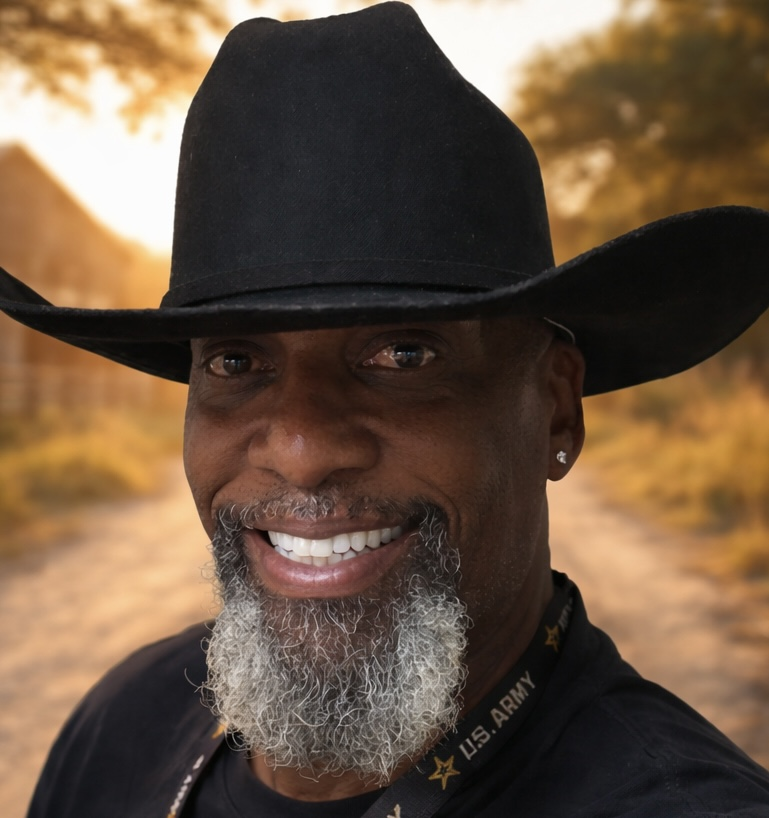

# MyZ Backroads Website

A complete static website for **MyZ Backroads**, built for GitHub and Netlify.

## Fastest way to publish

1. Download and unzip this package.
2. Open your GitHub repository: `myzbackroads/myzbackroads`.
3. Click **Add file** → **Upload files**.
4. Drag **all files and folders inside this package** into GitHub.
5. In the commit box, type: `Add MyZ Backroads website`
6. Click **Commit changes**.
7. Netlify should redeploy automatically within a few minutes.

The repository root must contain `index.html`.

## Files included

- `index.html` — main website
- `privacy.html` — privacy page
- `404.html` — custom page-not-found screen
- `netlify.toml` — Netlify settings
- `styles.css` — design, responsive layout, and Phase 1 visual system
- `main.js` — mobile menu behavior and dynamic copyright year
- root image files (`*.svg`, `*.png`, `*.jpg`) — website artwork, cover art, portraits, and placeholders

## Updating the portrait

The homepage currently uses `michael-maraia.jpg` for the portrait card and `hero-michael-horse.jpg` for the hero background. Replace either root-level image file with an optimized JPG/PNG of the same name, or update the matching `src`/CSS reference in `index.html` and `styles.css`.

Example:

```html

```

## Replacing gallery placeholders

Upload your photos to the repository root or a dedicated image folder, then change the image paths in the Gallery section of `index.html`.

## Updating music links

Search `index.html` for the existing YouTube, Spotify, Apple Music, Instagram, and TikTok links and replace any link that changes.

## Contact email

The website currently uses:

`mcmaraia@gmail.com`

## No build command required

This is a plain HTML/CSS/JavaScript website. Netlify should use:

- Base directory: blank
- Build command: blank
- Publish directory: blank or `.`
